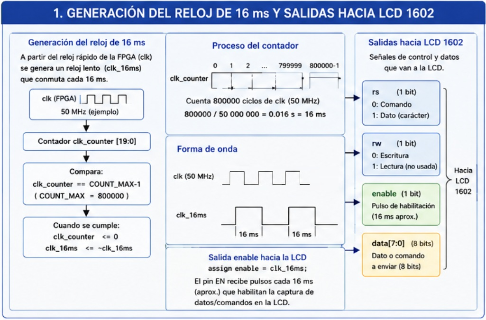
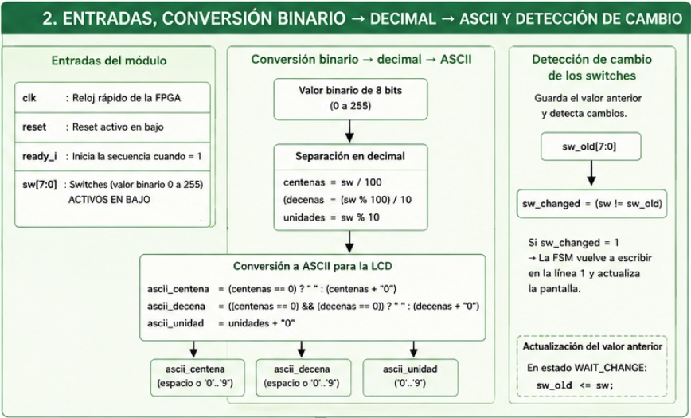
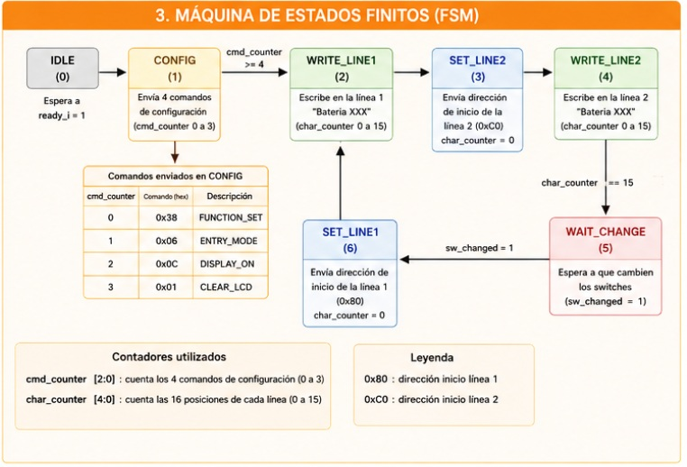
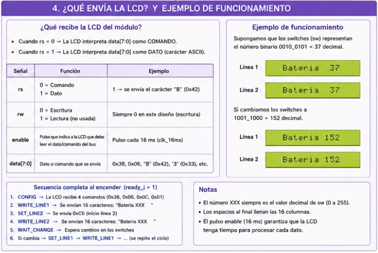
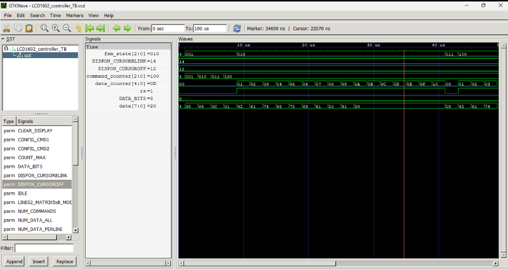
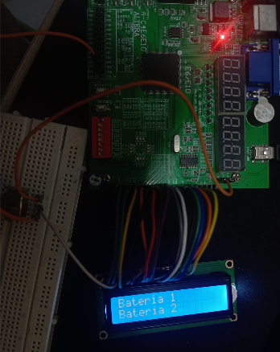
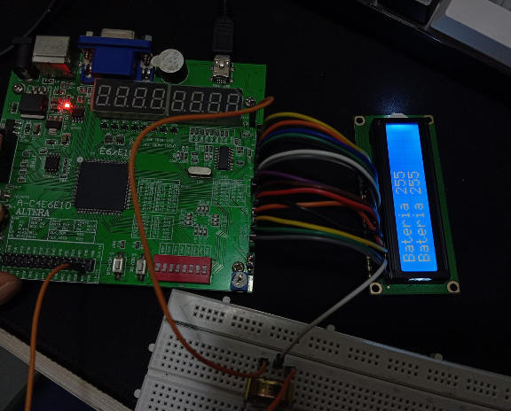
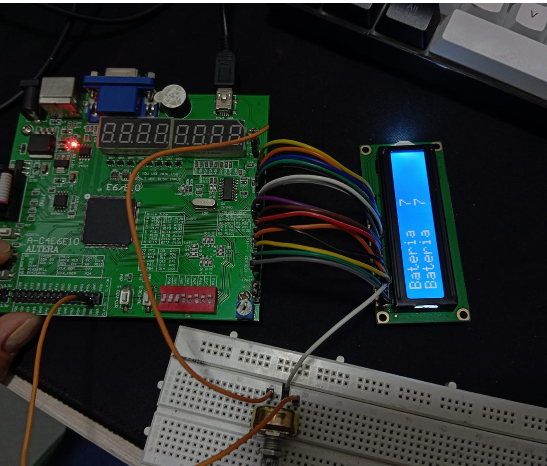
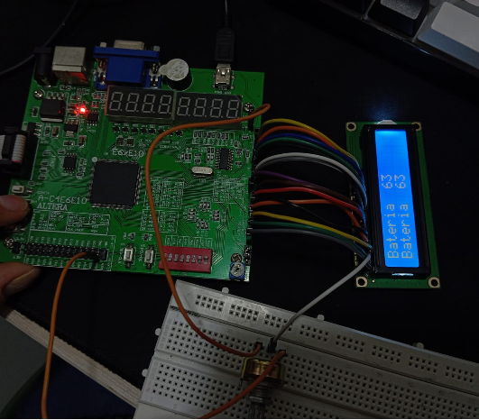

 
#  

## Integrantes 

- **Ana María Garnica Vargas cc.1098506060** 
- **Diego Alejandro Garzon Niño cc.1069256890** 
- **Kevin Santiago Umaña Cervera cc.112211939** 
**Junio 2026**

## Diseño implementado

El diseño implementado corresponde a un controlador en Verilog para una pantalla LCD1602 sobre FPGA, cuyo objetivo es recibir un valor binario de 8 bits desde interruptores (sw[7:0]), convertirlo a formato decimal en ASCII y visualizarlo en pantalla junto con el texto fijo “Bateria”. La arquitectura del sistema se organiza de forma modular para separar claramente las tareas de temporización, procesamiento de datos y control secuencial.

En primer lugar, se implementa un bloque de generación de temporización mediante un contador que divide la frecuencia del reloj principal de la FPGA. Este bloque produce una señal de habilitación de baja frecuencia utilizada para sincronizar la comunicación con la LCD, garantizando el cumplimiento de los tiempos mínimos requeridos por el dispositivo. Esta señal no actúa como un reloj convencional, sino como un pulso de control para la escritura de datos.

El segundo bloque corresponde al procesamiento de entrada, donde el valor binario sw[7:0] se convierte a representación decimal mediante operaciones de división y módulo, obteniendo centenas, decenas y unidades. Posteriormente, cada dígito se transforma a su equivalente ASCII sumando el valor base del carácter ‘0’. Adicionalmente, se incorpora un sistema de detección de cambios que compara el valor actual con el anterior, activando una señal de actualización únicamente cuando se detecta una variación en las entradas.

Finalmente, el control general del sistema se realiza mediante una máquina de estados finitos (FSM), encargada de inicializar la LCD, posicionar el cursor, escribir los caracteres en ambas líneas y gestionar la actualización dinámica del display. Esta FSM coordina el envío de comandos y datos a través del bus de 8 bits, controlando las señales RS, RW, Enable y Data[7:0]. En conjunto, el diseño permite una interfaz estable entre la FPGA y la LCD1602, asegurando una visualización correcta y coherente de la información en todo momento.

## Análisis del controlador LCD1602 en Verilog

El presente módulo implementa un controlador para una pantalla LCD1602 utilizando una FPGA.
Su función principal consiste en leer un valor binario de 8 bits proveniente de interruptores
(<code>sw[7:0]</code>), convertir dicho valor a formato decimal y posteriormente mostrarlo en la
pantalla LCD junto con el texto <b>"Bateria"</b>. Para lograrlo, el diseño se divide en cuatro
bloques funcionales principales: generación del reloj de comunicación, procesamiento de entradas,
máquina de estados y visualización en la LCD.

<h2>1. Generación del reloj de 16 ms y señales de control de la LCD</h2>

La pantalla LCD1602 posee tiempos de respuesta significativamente mayores que la frecuencia de
operación de una FPGA. Por esta razón, no es posible transmitir información directamente utilizando
el reloj principal del sistema. Para solucionar este problema se implementa un divisor de frecuencia
que genera una señal mucho más lenta denominada <code>clk_16ms</code>.

El bloque utiliza un contador (<code>clk_counter</code>) que incrementa su valor en cada flanco positivo
del reloj principal. Cuando el contador alcanza el valor definido por el parámetro
<code>COUNT_MAX - 1</code>, el contador se reinicia y conmuta el estado de la señal
<code>clk_16ms</code>.

<pre>
clk principal
      │
      ▼
┌─────────────────┐
│   clk_counter   │
└─────────────────┘
      │
      ▼
┌─────────────────┐
│    clk_16ms     │
└─────────────────┘
      │
      ▼
LCD1602
</pre>

Esta señal se conecta directamente a la salida <code>enable</code> del módulo LCD. Cada pulso de
habilitación indica a la pantalla que debe capturar el dato o comando presente en el bus de datos.

<h3>Señales de control utilizadas</h3>

<table>
<tr>
<th>Señal</th>
<th>Descripción</th>
</tr>

<tr>
<td><b>RS</b></td>
<td>
Selecciona el tipo de información enviada.
<ul>
<li>RS = 0 → Comando.</li>
<li>RS = 1 → Dato ASCII.</li>
</ul>
</td>
</tr>

<tr>
<td><b>RW</b></td>
<td>
Selecciona el modo de operación.
<ul>
<li>RW = 0 → Escritura.</li>
<li>RW = 1 → Lectura.</li>
</ul>
En este diseño permanece permanentemente en modo escritura.
</td>
</tr>

<tr>
<td><b>Enable</b></td>
<td>
Pulso de habilitación utilizado para que la LCD capture la información presente en el bus de datos.
</td>
</tr>

<tr>
<td><b>Data[7:0]</b></td>
<td>
Bus de datos de 8 bits que contiene comandos o caracteres ASCII.
</td>
</tr>

</table>

Este bloque garantiza que toda la comunicación con la LCD se realice respetando las restricciones
temporales impuestas por el dispositivo.

<h2>2. Entradas, conversión binario–decimal–ASCII y detección de cambios</h2>

La información mostrada en la pantalla proviene de los interruptores conectados a la entrada
<code>sw[7:0]</code>. Estos ocho bits representan un número binario sin signo cuyo rango es:

<pre>
0 ≤ sw ≤ 255
</pre>

Sin embargo, la pantalla LCD únicamente puede representar caracteres ASCII, por lo que es necesario
realizar una conversión previa.

<h3>Conversión binario a decimal</h3>

El valor binario se descompone en centenas, decenas y unidades utilizando operaciones aritméticas:

<pre>
centenas = sw / 100;
decenas  = (sw % 100) / 10;
unidades = sw % 10;
</pre>

Por ejemplo:

<pre>
sw = 153

centenas = 1
decenas  = 5
unidades = 3
</pre>

<h3>Conversión decimal a ASCII</h3>

Cada dígito decimal debe transformarse en un carácter ASCII. Esto se logra sumando el código ASCII
del carácter '0'.

<pre>
ascii_centena = centenas + "0";
ascii_decena  = decenas  + "0";
ascii_unidad  = unidades + "0";
</pre>

Para el ejemplo anterior:

<pre>
1 → '1'
5 → '5'
3 → '3'
</pre>

El resultado final es la cadena:

<pre>
"153"
</pre>

<h3>Detección de cambios</h3>

El sistema almacena el último valor mostrado utilizando el registro:

<pre>
sw_old
</pre>

Posteriormente compara continuamente el valor actual con el almacenado:

<pre>
sw_changed = (sw != sw_old);
</pre>

Si ambos valores son diferentes, la señal <code>sw_changed</code> se activa y solicita una
actualización de la pantalla.

<pre>
Valor anterior = 45
Valor actual   = 78

sw_changed = 1
</pre>

Este mecanismo evita reescrituras innecesarias y mejora la eficiencia del sistema.

<h2>3. Máquina de estados finitos (FSM)</h2>

La máquina de estados es el núcleo de control del controlador LCD. Su función es coordinar la
inicialización del display, la escritura de caracteres y la actualización de la información.

<h3>Estados implementados</h3>

<pre>
IDLE
CONFIG
WRITE_LINE1
SET_LINE2
WRITE_LINE2
WAIT_CHANGE
SET_LINE1
</pre>

<h3>Diagrama conceptual de funcionamiento</h3>

<pre>
                 ready_i
                    │
                    ▼
┌─────────┐     ┌──────────┐
│  IDLE   │ ──► │ CONFIG   │
└─────────┘     └──────────┘
                    │
                    ▼
             ┌─────────────┐
             │WRITE_LINE1  │
             └─────────────┘
                    │
                    ▼
              ┌──────────┐
              │SET_LINE2 │
              └──────────┘
                    │
                    ▼
             ┌─────────────┐
             │WRITE_LINE2  │
             └─────────────┘
                    │
                    ▼
             ┌─────────────┐
             │WAIT_CHANGE  │
             └─────────────┘
                    │
             sw_changed
                    │
                    ▼
              ┌──────────┐
              │SET_LINE1 │
              └──────────┘
                    │
                    ▼
             ┌─────────────┐
             │WRITE_LINE1  │
             └─────────────┘
</pre>

<h3>Descripción de cada estado</h3>

<h4>IDLE</h4>

Estado inicial del sistema. La FSM permanece detenida hasta recibir la señal
<code>ready_i</code>.

<h4>CONFIG</h4>

Inicializa la LCD enviando los comandos obligatorios:

<table>
<tr>
<th>Comando</th>
<th>Valor hexadecimal</th>
<th>Función</th>
</tr>

<tr>
<td>FUNCTION_SET</td>
<td>0x38</td>
<td>Configura interfaz de 8 bits y dos líneas.</td>
</tr>

<tr>
<td>ENTRY_MODE</td>
<td>0x06</td>
<td>Incrementa automáticamente el cursor.</td>
</tr>

<tr>
<td>DISPLAY_ON</td>
<td>0x0C</td>
<td>Activa la pantalla.</td>
</tr>

<tr>
<td>CLEAR_LCD</td>
<td>0x01</td>
<td>Limpia la memoria de visualización.</td>
</tr>

</table>

<h4>WRITE_LINE1</h4>

Escribe el mensaje en la primera línea utilizando el contador
<code>char_counter</code>.

<h4>SET_LINE2</h4>

Reposiciona el cursor al inicio de la segunda línea enviando:

<pre>
0xC0
</pre>

<h4>WRITE_LINE2</h4>

Escribe el mismo mensaje en la segunda línea de la LCD.

<h4>WAIT_CHANGE</h4>

Espera modificaciones en los interruptores.

<h4>SET_LINE1</h4>

Reposiciona el cursor al inicio de la primera línea mediante:

<pre>
0x80
</pre>

Posteriormente reinicia el proceso de escritura para actualizar la información.

<h2>4. Información enviada a la LCD y ejemplo de funcionamiento</h2>

La comunicación con la LCD se realiza mediante la transmisión secuencial de comandos y caracteres
ASCII sobre el bus <code>data[7:0]</code>.

<h3>Comandos enviados durante la inicialización</h3>

<table>
<tr>
<th>Hexadecimal</th>
<th>Función</th>
</tr>

<tr>
<td>0x38</td>
<td>Configuración de interfaz de 8 bits.</td>
</tr>

<tr>
<td>0x06</td>
<td>Incremento automático del cursor.</td>
</tr>

<tr>
<td>0x0C</td>
<td>Activación del display.</td>
</tr>

<tr>
<td>0x01</td>
<td>Limpieza de pantalla.</td>
</tr>

<tr>
<td>0x80</td>
<td>Inicio línea 1.</td>
</tr>

<tr>
<td>0xC0</td>
<td>Inicio línea 2.</td>
</tr>

</table>

<h3>Mensaje generado</h3>

El controlador construye la cadena:

<pre>
Bateria XXX
</pre>

donde <code>XXX</code> corresponde al valor decimal calculado a partir de los interruptores.

<h3>Ejemplo 1</h3>

<pre>
sw = 0010 0101
</pre>

Conversión:

<pre>
0010 0101₂ = 37₁₀
</pre>

Contenido mostrado:

<pre>
Bateria 37
Bateria 37
</pre>

<h3>Ejemplo 2</h3>

<pre>
sw = 1001 1000
</pre>

Conversión:

<pre>
1001 1000₂ = 152₁₀
</pre>

Contenido mostrado:

<pre>
Bateria 152
Bateria 152
</pre>

<h3>Proceso completo de funcionamiento</h3>

<pre>
SW[7:0]
    │
    ▼
Conversión Binario → Decimal
    │
    ▼
Conversión Decimal → ASCII
    │
    ▼
Detección de cambios
    │
    ▼
Máquina de estados
    │
    ▼
RS, RW, ENABLE, DATA
    │
    ▼
LCD1602
    │
    ▼
Visualización del mensaje
</pre>

En conclusión, el módulo implementa una arquitectura basada en una máquina de estados finitos que
permite inicializar una pantalla LCD1602, convertir información binaria en texto legible y actualizar
dinámicamente la visualización cada vez que se detecta una modificación en las entradas del sistema.

## RESULTADOS 
### RESULTADO TESTBENCH PANTALLA LCD ESTATICA 

El testbench desarrollado tiene como propósito verificar el correcto funcionamiento del módulo `LCD1602_controller` mediante simulación. Para ello, se generan las señales de entrada necesarias, incluyendo el reloj (`clk`), la señal de reinicio (`rst`) y la señal de habilitación (`ready_i`). El reloj se genera de manera periódica con un período de 20 ns mediante una instrucción `always`, permitiendo el avance temporal de la máquina de estados.

Inicialmente se activa la señal de reinicio para garantizar que el sistema comience desde un estado conocido y posteriormente se desactiva para iniciar la ejecución normal del controlador. La señal `ready_i` se mantiene en nivel alto para permitir que la FSM inicie el proceso de configuración de la pantalla LCD y la transmisión de datos. la simulación se ejecuta durante un tiempo suficiente para observar la secuencia completa de inicialización de la pantalla, el envío de los comandos de configuración y la escritura de los caracteres correspondientes al mensaje estático mostrado en las dos líneas de la LCD.

##  RESULTADOS FPGA PANTALLA LCD ESTATICA
l diseño fue implementado y probado en la tarjeta FPGA, verificando su correcto funcionamiento sobre el hardware real. Durante las pruebas se observó que la señal ready_i controla el inicio de la secuencia de escritura de la pantalla LCD. Cuando esta señal permanecía activada, la máquina de estados reiniciaba continuamente el proceso de envío de comandos y datos, ocasionando que el texto apareciera y desapareciera periódicamente en la pantalla. Por otro lado, cuando ready_i permanecía desactivada después de la inicialización, el mensaje mostrado permanecía estable y estático. Como se puede apreciar en la figura correspondiente, la pantalla LCD visualiza correctamente los mensajes "BATERIA 1" y "BATERIA 2" en la primera y segunda línea, respectivamente, validando el correcto funcionamiento del controlador implementado.

### RESULTADOS FPGA PANTALLA LCD DINAMICA
En esta sección se evalúa el funcionamiento del controlador LCD1602 implementado en FPGA mediante tres casos de prueba representativos. El objetivo es validar la correcta conversión de valores binarios de 8 bits a representación decimal en formato ASCII, así como el comportamiento dinámico de la máquina de estados encargada de la actualización de la pantalla. En todos los casos, la salida esperada es la visualización del texto “Bateria” acompañado del valor decimal correspondiente a las entradas sw[7:0].

#### CASO 1

En el primer caso, se aplica el valor máximo de entrada 255 (11111111₂). La pantalla muestra correctamente “Bateria 255” en ambas líneas, lo que confirma que el sistema es capaz de manejar el rango completo de 8 bits sin errores de desbordamiento ni fallos en la descomposición en centenas, decenas y unidades. Esto valida el correcto funcionamiento del bloque de conversión binario–decimal y su posterior transformación a ASCII.

#### CASO 2

En el segundo caso, se evalúa el valor mínimo no nulo 7 (00000111₂). El sistema muestra “Bateria 7” de forma estable, sin residuos de dígitos previos en pantalla. Esto evidencia que la lógica de escritura en la LCD gestiona adecuadamente los números de un solo dígito, evitando errores comunes como la persistencia de caracteres antiguos, lo cual depende directamente del control de la FSM y del manejo correcto del cursor.

#### CASO 3 
Finalmente, en el tercer caso se utiliza el valor intermedio 63 (00111111₂). La salida “Bateria 63” confirma el correcto funcionamiento del sistema en condiciones típicas de operación. En este punto se valida la estabilidad general del diseño, ya que el sistema realiza correctamente la separación en decenas y unidades y actualiza la pantalla sin inconsistencias.

En conjunto, los tres casos demuestran que el controlador LCD funciona de manera correcta en todo el rango de operación de 0 a 255. Se valida tanto la precisión en la conversión de datos como la estabilidad de la máquina de estados y la correcta sincronización de la interfaz con la LCD1602.

## Conclusiones

El desarrollo del controlador para la pantalla LCD1602 en FPGA permitió integrar de manera funcional varios bloques fundamentales de la electrónica digital, como la generación de señales de temporización, el procesamiento de datos de entrada y la implementación de una máquina de estados finitos para el control secuencial del sistema. Esto demuestra la importancia de una arquitectura modular para garantizar el correcto funcionamiento de sistemas digitales complejos.

Se comprobó que la conversión de valores binarios de 8 bits a representación decimal en formato ASCII se realiza de manera correcta para todo el rango de entrada (0 a 255). Los casos evaluados validaron la precisión del sistema tanto en valores extremos como en valores intermedios, evidenciando la correcta implementación del algoritmo de conversión y del manejo de datos para visualización en pantalla.

Asimismo, se verificó el correcto funcionamiento de la máquina de estados finitos encargada de la inicialización, escritura y actualización de la LCD. El uso de detección de cambios en la entrada (sw_changed) permitió optimizar el sistema al evitar escrituras innecesarias, mejorando la eficiencia del controlador.

Finalmente, se concluye que el diseño cumple con los objetivos propuestos, logrando una interfaz estable entre la FPGA y la LCD1602, con una correcta sincronización temporal y una visualización coherente de la información. Este tipo de implementación refuerza conceptos clave de diseño digital como control secuencial, manejo de periféricos y procesamiento de datos en hardware.

